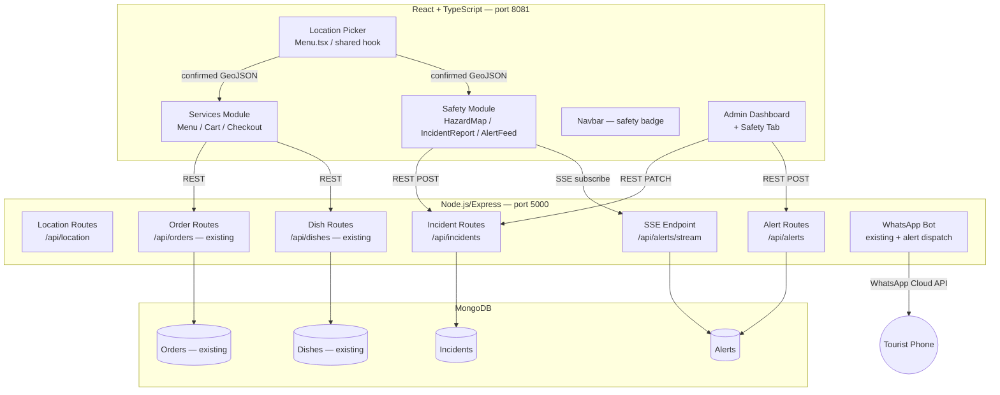

# Design Document: Smart Tourist Safety Monitoring & Incident Response System

## Overview

The Smart Tourist Safety Monitoring & Incident Response System extends the existing Foodizzz application (React 18 + TypeScript + Tailwind CSS frontend, Node.js/Express + MongoDB backend) by adding a Safety layer alongside the existing Services layer. The two modules share the same location data pipeline, design system, and WhatsApp notification infrastructure.

The architecture follows a **module-extension** pattern: no existing code is deleted; new routes, models, components, and pages are added alongside existing ones. The frontend communicates with the backend exclusively over HTTP REST (existing pattern) plus a new Server-Sent Events (SSE) channel for real-time alert delivery.

---

## Architecture



---

## Components and Interfaces

### Frontend — New Components

| Component | Path | Responsibility |
|---|---|---|
| `useLocation` hook | `src/hooks/use-location.ts` | Shared GPS + address resolution logic extracted from `Menu.tsx` |
| `SafetyBadge` | `src/components/ui/safety-badge.tsx` | Navbar badge showing active incident count within 5 km |
| `HazardMap` | `src/pages/HazardMap.tsx` | Leaflet map with incident markers, detail panel |
| `IncidentReportForm` | `src/components/IncidentReportForm.tsx` | Form to submit a new incident |
| `AlertFeed` | `src/components/AlertFeed.tsx` | SSE-driven list of incoming alerts |
| `IncidentCard` | `src/components/IncidentCard.tsx` | Single incident display (map popup + admin list) |
| `SafetyTab` | `src/components/admin/SafetyTab.tsx` | Admin dashboard Safety tab |

### Frontend — Modified Components

| Component | Change |
|---|---|
| `Menu.tsx` | Extract location logic into `useLocation` hook; call `shareLocationWithSafety()` on confirm |
| `Navbar` | Import and render `SafetyBadge` |
| `AdminDashboard.tsx` | Add "Safety" tab, import `SafetyTab` |
| `App.tsx` | Add routes `/safety`, `/safety/report`, `/safety/map` |

### Backend — New Modules

| File | Responsibility |
|---|---|
| `src/models/Incident.js` | Mongoose schema for incidents |
| `src/models/Alert.js` | Mongoose schema for alerts |
| `src/routes/incidentRoutes.js` | CRUD + status update for incidents |
| `src/routes/alertRoutes.js` | Alert creation + SSE stream endpoint |
| `src/controllers/incidentController.js` | Business logic: create, list, update status, delete |
| `src/controllers/alertController.js` | Proximity query, SSE client registry, dispatch |

---

## Data Models

### Incident (MongoDB)

```js
{
  type: { type: String, enum: ['crime','medical','fire','flood','traffic','other'], required: true },
  description: { type: String, required: true, maxlength: 500 },
  location: {
    type: { type: String, enum: ['Point'], default: 'Point' },
    coordinates: [Number]  // [longitude, latitude]
  },
  reportedBy: { type: String, default: 'anonymous' },
  status: { type: String, enum: ['open','resolved'], default: 'open' },
  alertRadius: { type: Number, default: 2000 },  // metres
  createdAt, updatedAt  // timestamps: true
}
// Index: { location: '2dsphere' }
```

### Alert (MongoDB)

```js
{
  incident: { type: ObjectId, ref: 'Incident', required: true },
  recipientLocation: {
    type: { type: String, enum: ['Point'], default: 'Point' },
    coordinates: [Number]
  },
  recipientPhone: { type: String },
  channel: { type: String, enum: ['sse','whatsapp'], required: true },
  status: { type: String, enum: ['pending','delivered','cancelled'], default: 'pending' },
  createdAt, updatedAt
}
```

### TypeScript Types (frontend)

```ts
// src/types/index.ts additions
export type IncidentType = 'crime' | 'medical' | 'fire' | 'flood' | 'traffic' | 'other';
export type IncidentStatus = 'open' | 'resolved';

export interface Incident {
  _id: string;
  type: IncidentType;
  description: string;
  location: { type: 'Point'; coordinates: [number, number] };
  reportedBy: string;
  status: IncidentStatus;
  alertRadius: number;
  createdAt: string;
  updatedAt: string;
}

export interface SafetyAlert {
  _id: string;
  incident: Incident;
  channel: 'sse' | 'whatsapp';
  status: 'pending' | 'delivered' | 'cancelled';
  createdAt: string;
}
```

---

## Correctness Properties

*A property is a characteristic or behavior that should hold true across all valid executions of a system — essentially, a formal statement about what the system should do. Properties serve as the bridge between human-readable specifications and machine-verifiable correctness guarantees.*

### Property 1: Location round-trip consistency

*For any* valid address string or GPS coordinate pair, confirming the location and then reading it back from `sessionStorage` should produce an equivalent value (same address string or same coordinate pair within floating-point tolerance).

**Validates: Requirements 1.1, 1.3, 1.6**

---

### Property 2: GPS fallback on reverse-geocode failure

*For any* GPS coordinate pair where the Nominatim API returns an error, the Location_Service should populate the address field with the raw decimal coordinate string `"lat, lon"` rather than an empty string or an error message.

**Validates: Requirements 1.4**

---

### Property 3: Incident creation persists all required fields

*For any* valid incident payload (type ∈ allowed enum, non-empty description, valid GeoJSON point), creating an incident via `POST /api/incidents` should result in a document retrievable via `GET /api/incidents/:id` that contains identical `type`, `description`, `location`, and `status = 'open'`.

**Validates: Requirements 2.1, 2.5**

---

### Property 4: Invalid incident payloads are rejected

*For any* incident payload where `type` is not in the allowed enum OR `location` is absent, `POST /api/incidents` should return HTTP 422 and no document should be created in MongoDB.

**Validates: Requirements 2.3, 2.4**

---

### Property 5: Alert proximity invariant

*For any* incident and *for any* tourist location, an Alert should be dispatched if and only if the distance between the incident location and the tourist location is ≤ `incident.alertRadius` metres.

**Validates: Requirements 2.2, 3.1**

---

### Property 6: Resolved incidents stop generating alerts

*For any* incident with `status = 'resolved'`, no new Alert documents should be created for that incident regardless of how many tourists are within the alert radius.

**Validates: Requirements 2.6, 6.3**

---

### Property 7: Alert content completeness

*For any* Alert delivered via SSE, the payload should contain `incidentType`, `description` (≤ 140 characters), `distanceMetres`, and `createdAt`.

**Validates: Requirements 3.2**

---

### Property 8: Skeleton loaders prevent blank screens

*For any* page that fetches asynchronous data, while the fetch is in-flight the DOM should contain at least one element with the `animate-pulse` class and no empty content containers.

**Validates: Requirements 7.1, 5.3**

---

### Property 9: Cart persistence across page refresh

*For any* cart state, serialising it to `localStorage` and then deserialising it (simulating a page refresh) should produce a cart with identical items and quantities.

**Validates: Requirements 7.4**

---

### Property 10: Geo-targeted broadcast reaches correct recipients

*For any* broadcast with a specified centre point and radius, every recipient phone number in the delivery list should correspond to a tourist whose last-known location is within that radius, and no phone number outside the radius should appear in the list.

**Validates: Requirements 6.4**

---

## Error Handling

| Scenario | Handling |
|---|---|
| Backend unreachable on menu load | Skeleton loaders → fallback dish list after 10 s timeout |
| Geolocation API denied | Inline error, address field unchanged |
| Nominatim API failure | Fall back to raw `lat, lon` string |
| Incident POST with missing location | HTTP 422 + descriptive JSON error |
| Incident POST with invalid type | HTTP 422 + descriptive JSON error |
| SSE connection drop | Exponential back-off reconnect (1 s → 30 s, max 5 retries) |
| Razorpay SDK load failure | Toast error, payment flow aborted gracefully |
| Fetch timeout (> 10 s) | Error toast + `console.error` log |

---

## Testing Strategy

### Dual Testing Approach

Both unit tests and property-based tests are required. They are complementary:
- **Unit tests** cover specific examples, integration points, and edge cases.
- **Property-based tests** verify universal correctness across randomly generated inputs.

### Property-Based Testing

Library: **fast-check** (TypeScript/JavaScript, works with Vitest).

Each property test runs a minimum of **100 iterations**.

Tag format per test: `// Feature: smart-tourist-safety-system, Property N: <property_text>`

| Property | Test description |
|---|---|
| P1 | Generate random address strings; confirm → read sessionStorage → assert equality |
| P2 | Mock Nominatim to fail; generate random coords; assert field = `"lat, lon"` |
| P3 | Generate valid incident payloads; POST → GET → assert field equality |
| P4 | Generate payloads with invalid type or missing location; assert HTTP 422, no DB write |
| P5 | Generate incident + tourist location pairs; assert alert dispatched iff distance ≤ radius |
| P6 | Generate resolved incidents; attempt alert dispatch; assert no new Alert documents |
| P7 | Generate alerts; assert payload contains all required fields with correct constraints |
| P8 | Mount components with mocked pending fetch; assert `animate-pulse` present in DOM |
| P9 | Generate cart states; serialise → deserialise; assert deep equality |
| P10 | Generate broadcast params + tourist locations; assert recipient list matches radius filter |

### Unit Tests

Library: **Vitest** + **React Testing Library** (already in the project via Vite).

Focus areas:
- `useLocation` hook: GPS success, GPS error, Nominatim failure, address confirmation, reset
- `incidentController`: create, list, update status, delete with unresolved alerts
- `alertController`: proximity query correctness, SSE client registration/deregistration
- `SafetyBadge`: renders correct count, updates on new incident
- `IncidentReportForm`: validation, submission, error display
- `AdminDashboard` Safety tab: list rendering, status update flow
